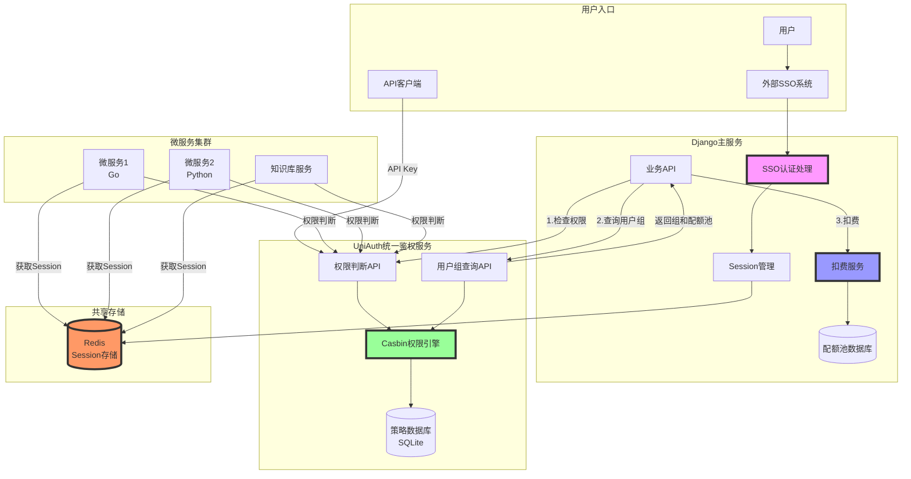
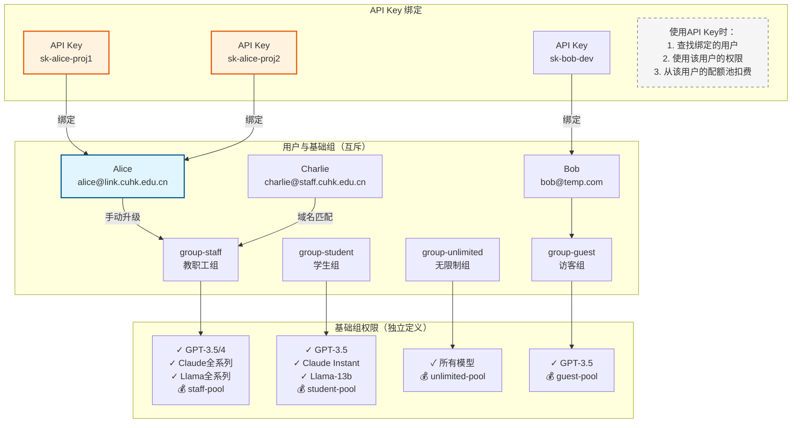
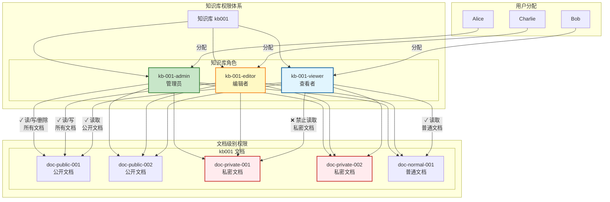
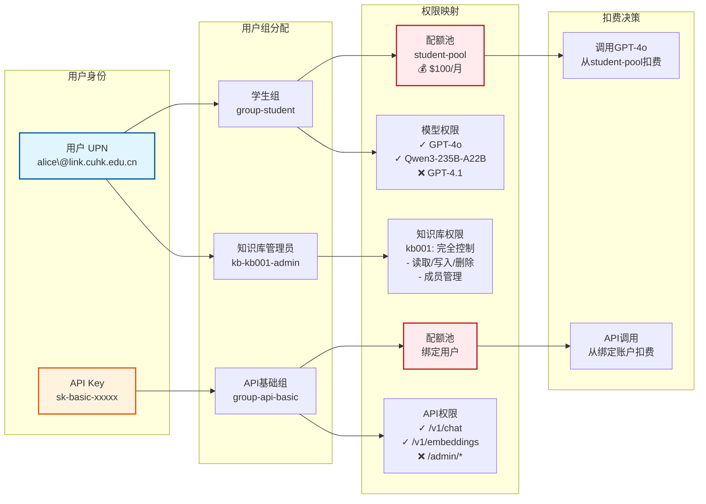

# 整体系统架构图
- Django主服务：继续负责SSO认证、Session管理和扣费
- UniAuth服务：专注于权限判断和用户组查询
- Redis：共享Session存储
- 微服务：通过Redis获取用户身份，调用UniAuth进行权限判断

# 详细数据流程图
- 认证流程：用户通过SSO登录，Django存储Session到Redis
- 模型调用流程：权限检查→查询用户组→扣费→返回结果
- 微服务访问流程：从Redis获取身份→权限检查→执行业务
- API Key调用流程：将API Key映射为特殊UPN进行权限控制

# 权限模型结构图
- 用户只能属于一个基础组（互斥）：student/staff/unlimited/guest
- 每个组的权限独立定义，避免继承带来的混乱
- 每个基础组对应一个配额池，扣费逻辑清晰

- 知识库角色：admin/editor/viewer
- 默认权限：继承知识库级别的权限
- 特殊权限：可以针对特定文档模式设置allow/deny
    - 如：viewer可以读公开文档，但不能读私密文档

# 权限流转示意图

