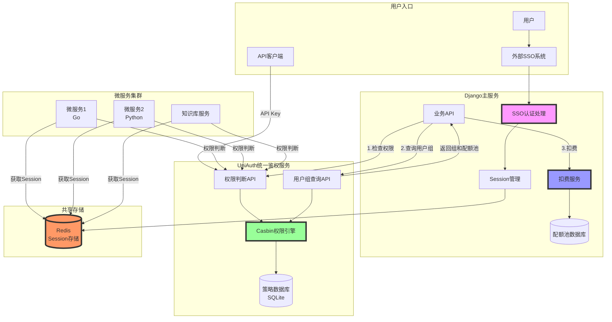
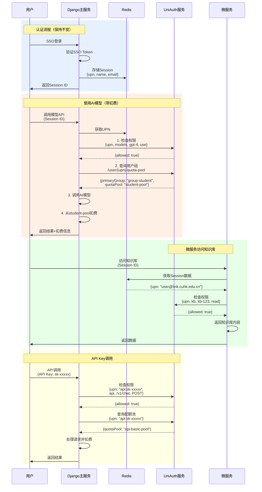

# 架构1



# 架构2


# 架构3
```mermaid
graph TB
    subgraph "用户与组关系"
        U1[alice@link.cuhk.edu.cn]
        U2[bob@staff.cuhk.edu.cn]
        U3[api:sk-basic-xxxxx]
        
        G1[group-student]
        G2[group-staff]
        G3[group-unlimited]
        G4[group-api-basic]
        
        U1 --> G1
        U1 --> |特殊升级| G2
        U2 --> G2
        U3 --> G4
        
        G3 --> |继承| G2
        G2 --> |继承| G1
    end
    
    subgraph "权限策略"
        G1 --> P1[模型权限<br/>✓ gpt-3.5<br/>✗ gpt-4]
        G1 --> P2[配额池<br/>student-pool]
        
        G2 --> P3[模型权限<br/>✓ gpt-3.5<br/>✓ gpt-4<br/>✓ claude]
        G2 --> P4[配额池<br/>staff-pool]
        
        G3 --> P5[模型权限<br/>✓ 所有模型]
        G3 --> P6[配额池<br/>unlimited-pool]
        
        G4 --> P7[API权限<br/>✓ /v1/chat<br/>✓ /v1/embeddings]
        G4 --> P8[配额池<br/>api-basic-pool]
    end
    
    subgraph "知识库权限"
        U1 --> KB1[kb-kb001-admin]
        KB1 --> KBP1[知识库kb001<br/>✓ 所有权限]
        
        U2 --> KB2[kb-kb002-reader]
        KB2 --> KBP2[知识库kb002<br/>✓ 只读权限]
    end
    
    style G1 fill:#ffd,stroke:#333,stroke-width:2px
    style G2 fill:#dfd,stroke:#333,stroke-width:2px
    style G3 fill:#ddf,stroke:#333,stroke-width:2px
    style P2 fill:#faa,stroke:#333,stroke-width:2px
    style P4 fill:#afa,stroke:#333,stroke-width:2px
    style P6 fill:#aaf,stroke:#333,stroke-width:2px
```
