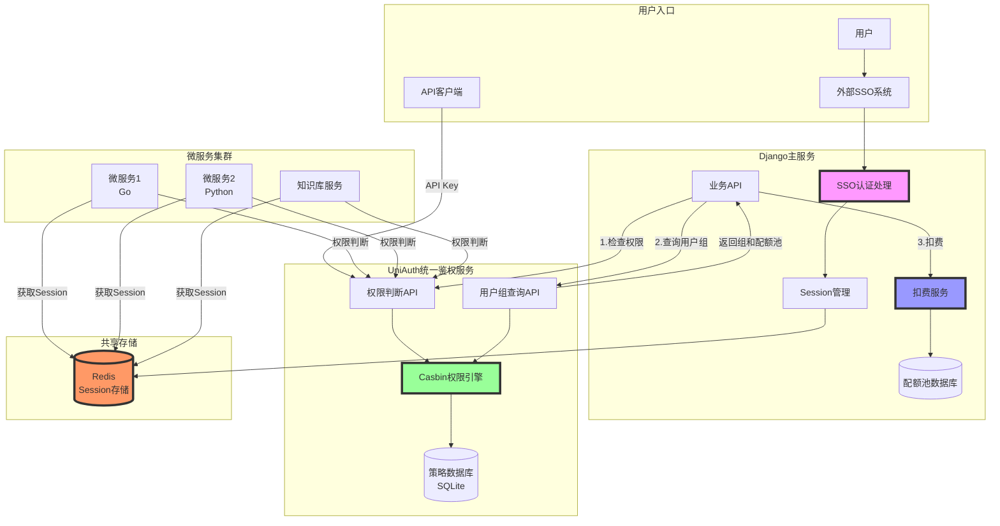

```mermaid
graph TB
    subgraph "用户入口"
        User[用户]
        APIClient[API客户端]
        SSO[外部SSO系统]
    end
    
    subgraph "Django主服务"
        DjangoAuth[SSO认证处理]
        DjangoSession[Session管理]
        BillingService[扣费服务]
        DjangoAPI[业务API]
        QuotaDB[(配额池数据库)]
    end
    
    subgraph "UniAuth统一鉴权服务"
        CasbinEngine[Casbin权限引擎]
        AuthAPI[权限判断API]
        GroupAPI[用户组查询API]
        PolicyDB[(策略数据库<br/>SQLite)]
    end
    
    subgraph "微服务集群"
        MS1[微服务1<br/>Go]
        MS2[微服务2<br/>Python]
        KBService[知识库服务]
    end
    
    subgraph "共享存储"
        Redis[(Redis<br/>Session存储)]
    end
    
    %% 认证流程
    User --> SSO
    SSO --> DjangoAuth
    DjangoAuth --> DjangoSession
    DjangoSession --> Redis
    
    %% API Key流程
    APIClient -->|API Key| AuthAPI
    
    %% 权限查询流程
    DjangoAPI -->|1.检查权限| AuthAPI
    DjangoAPI -->|2.查询用户组| GroupAPI
    GroupAPI -->|返回组和配额池| DjangoAPI
    DjangoAPI -->|3.扣费| BillingService
    BillingService --> QuotaDB
    
    %% 微服务流程
    MS1 -->|获取Session| Redis
    MS1 -->|权限判断| AuthAPI
    MS2 -->|获取Session| Redis
    MS2 -->|权限判断| AuthAPI
    KBService -->|获取Session| Redis
    KBService -->|权限判断| AuthAPI
    
    %% 数据存储
    CasbinEngine --> PolicyDB
    AuthAPI --> CasbinEngine
    GroupAPI --> CasbinEngine
    
    %% 样式
    style DjangoAuth fill:#f9f,stroke:#333,stroke-width:4px
    style Redis fill:#f96,stroke:#333,stroke-width:4px
    style CasbinEngine fill:#9f9,stroke:#333,stroke-width:4px
    style BillingService fill:#99f,stroke:#333,stroke-width:4px
```
