# 整体系统架构图
- Django主服务：继续负责SSO认证、Session管理和扣费
- UniAuth服务：专注于权限判断和用户组查询
- Redis：共享Session存储
- 微服务：通过Redis获取用户身份，调用UniAuth进行权限判断

```mermaid
graph TB
    subgraph "用户入口"
        User[用户]
        APIClient[API客户端]
        SSO[外部SSO系统]
    end
    
    subgraph "Django主服务"
        DjangoAuth[SSO认证处理]
        DjangoSession[Session管理]
        BillingService[扣费服务]
        DjangoAPI[业务API]
        QuotaDB[(配额池数据库)]
    end
    
    subgraph "UniAuth统一鉴权服务"
        CasbinEngine[Casbin权限引擎]
        AuthAPI[权限判断API]
        GroupAPI[用户组查询API]
        PolicyDB[(策略数据库<br/>SQLite)]
    end
    
    subgraph "微服务集群"
        MS1[微服务1<br/>Go]
        MS2[微服务2<br/>Python]
        KBService[知识库服务]
    end
    
    subgraph "共享存储"
        Redis[(Redis<br/>Session存储)]
    end
    
    %% 认证流程
    User --> SSO
    SSO --> DjangoAuth
    DjangoAuth --> DjangoSession
    DjangoSession --> Redis
    
    %% API Key流程
    APIClient -->|API Key| AuthAPI
    
    %% 权限查询流程
    DjangoAPI -->|1.检查权限| AuthAPI
    DjangoAPI -->|2.查询用户组| GroupAPI
    GroupAPI -->|返回组和配额池| DjangoAPI
    DjangoAPI -->|3.扣费| BillingService
    BillingService --> QuotaDB
    
    %% 微服务流程
    MS1 -->|获取Session| Redis
    MS1 -->|权限判断| AuthAPI
    MS2 -->|获取Session| Redis
    MS2 -->|权限判断| AuthAPI
    KBService -->|获取Session| Redis
    KBService -->|权限判断| AuthAPI
    
    %% 数据存储
    CasbinEngine --> PolicyDB
    AuthAPI --> CasbinEngine
    GroupAPI --> CasbinEngine
    
    %% 样式
    style DjangoAuth fill:#f9f,stroke:#333,stroke-width:4px
    style Redis fill:#f96,stroke:#333,stroke-width:4px
    style CasbinEngine fill:#9f9,stroke:#333,stroke-width:4px
    style BillingService fill:#99f,stroke:#333,stroke-width:4px
```

# 详细数据流程图
- 认证流程：用户通过SSO登录，Django存储Session到Redis
- 模型调用流程：权限检查→查询用户组→扣费→返回结果
- 微服务访问流程：从Redis获取身份→权限检查→执行业务
- API Key调用流程：将API Key映射为特殊UPN进行权限控制

```mermaid
sequenceDiagram
    participant User as 用户
    participant Django as Django主服务
    participant Redis as Redis
    participant UniAuth as UniAuth服务
    participant MS as 微服务
    
    rect rgb(230, 240, 255)
        Note over User,Django: 认证流程（保持不变）
        User->>Django: SSO登录
        Django->>Django: 验证SSO Token
        Django->>Redis: 存储Session<br/>{upn, name, email}
        Django->>User: 返回Session ID
    end
    
    rect rgb(255, 240, 230)
        Note over User,UniAuth: 使用AI模型（带扣费）
        User->>Django: 调用模型API<br/>(Session ID)
        Django->>Redis: 获取UPN
        Django->>UniAuth: 1. 检查权限<br/>{upn, models, gpt-4, use}
        UniAuth-->>Django: {allowed: true}
        Django->>UniAuth: 2. 查询用户组<br/>/user/{upn}/quota-pool
        UniAuth-->>Django: {primaryGroup: "group-student",<br/>quotaPool: "student-pool"}
        Django->>Django: 3. 调用AI模型
        Django->>Django: 4. 从student-pool扣费
        Django->>User: 返回结果+扣费信息
    end
    
    rect rgb(230, 255, 230)
        Note over MS,UniAuth: 微服务访问知识库
        User->>MS: 访问知识库<br/>(Session ID)
        MS->>Redis: 获取Session数据
        Redis-->>MS: {upn: "user@link.cuhk.edu.cn"}
        MS->>UniAuth: 检查权限<br/>{upn, kb, kb-123, read}
        UniAuth-->>MS: {allowed: true}
        MS->>MS: 返回知识库内容
        MS->>User: 返回数据
    end
    
    rect rgb(255, 255, 230)
        Note over User,UniAuth: API Key调用
        User->>Django: API调用<br/>(API Key: sk-xxxxx)
        Django->>UniAuth: 检查权限<br/>{upn: "api:sk-xxxxx",<br/>api, /v1/chat, POST}
        UniAuth-->>Django: {allowed: true}
        Django->>UniAuth: 查询绑定账号<br/>{upn: "api:sk-xxxxx"}
        UniAuth-->>Django: {real_upn: "user@link.cuhk.edu.cn"}
        Django->>Django: 处理请求并扣费
        Django->>User: 返回结果
    end
```

# 权限模型结构图
- 用户与组的关系：用户可以属于多个组，组之间有继承关系
- 组的权限策略：每个组对应不同的模型权限和配额池
- 知识库权限：独立的知识库权限体系

```mermaid
graph TB
    subgraph "用户与组关系"
        U1["alice\@link.cuhk.edu.cn"]
        U2["bob\@staff.cuhk.edu.cn"]
        U3["api:sk-basic-xxxxx"]
        
        G1[group-student]
        G2[group-staff]
        G3[group-unlimited]
        G4[group-api-basic]
        
        U1 --> G1
        U1 --> |特殊升级| G2
        U2 --> G2
        U3 --> G4
        
        G3 --> |继承| G2
        G2 --> |继承| G1
    end
    
    subgraph "权限策略"
        G1 --> P1["模型权限<br/>✓ gpt-3.5<br/>✗ gpt-4"]
        G1 --> P2["配额池<br/>student-pool"]
        
        G2 --> P3["模型权限<br/>✓ gpt-3.5<br/>✓ gpt-4<br/>✓ claude"]
        G2 --> P4["配额池<br/>staff-pool"]
        
        G3 --> P5["模型权限<br/>✓ 所有模型"]
        G3 --> P6["配额池<br/>unlimited-pool"]
        
        G4 --> P7["API权限<br/>✓ /v1/chat<br/>✓ /v1/embeddings"]
        G4 --> P8["配额池<br/>api-basic-pool"]
    end
    
    subgraph "知识库权限"
        U1 --> KB1[kb-kb001-admin]
        KB1 --> KBP1["知识库kb001<br/>✓ 所有权限"]
        
        U2 --> KB2[kb-kb002-reader]
        KB2 --> KBP2["知识库kb002<br/>✓ 只读权限"]
    end
    
    style G1 fill:#ffd,stroke:#333,stroke-width:2px
    style G2 fill:#dfd,stroke:#333,stroke-width:2px
    style G3 fill:#ddf,stroke:#333,stroke-width:2px
    style P2 fill:#faa,stroke:#333,stroke-width:2px
    style P4 fill:#afa,stroke:#333,stroke-width:2px
    style P6 fill:#aaf,stroke:#333,stroke-width:2px
```

# 权限流转示意图

```mermaid
graph LR
    subgraph "用户身份"
        USER["用户 UPN<br/>alice\@link.cuhk.edu.cn"]
        APIKEY["API Key<br/>sk-basic-xxxxx"]
    end
    
    subgraph "用户组分配"
        USER --> GS["学生组<br/>group-student"]
        USER --> GKB["知识库管理员<br/>kb-kb001-admin"]
        APIKEY --> GAPI["API基础组<br/>group-api-basic"]
    end
    
    subgraph "权限映射"
        GS --> QS["配额池<br/>student-pool<br/>💰 $100/月"]
        GS --> MS["模型权限<br/>✓ GPT-4o<br/>✓ Qwen3-235B-A22B<br/>❌ GPT-4.1"]
        
        GKB --> KBP["知识库权限<br/>kb001: 完全控制<br/>- 读取/写入/删除<br/>- 成员管理"]
        
        GAPI --> QAPI["配额池<br/>绑定用户"]
        GAPI --> MAPI["API权限<br/>✓ /v1/chat<br/>✓ /v1/embeddings<br/>❌ /admin/*"]
    end
    
    subgraph "扣费决策"
        QS --> BILL1["调用GPT-4o<br/>从student-pool扣费"]
        QAPI --> BILL2["API调用<br/>从绑定账户扣费"]
    end
    
    style USER fill:#e1f5fe,stroke:#01579b,stroke-width:2px
    style APIKEY fill:#fff3e0,stroke:#e65100,stroke-width:2px
    style QS fill:#ffebee,stroke:#b71c1c,stroke-width:2px
    style QAPI fill:#ffebee,stroke:#b71c1c,stroke-width:2px
```

